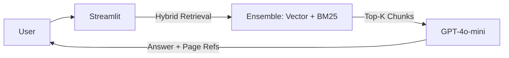

# 👑 Axiom AI: Production-Grade RAG Engine


**A high-fidelity RAG system optimized for precision, speed, and citations.**

Axiom AI v2.0 is a monolithic Streamlit application that delivers **Hybrid Search (Vector + Keyword)**, **Strict Source Citations**, and **Deep Linking** for PDF evidence. It is designed to run efficiently on Hugging Face Spaces.

---

## ✨ Key Features

### 🧠 Smart Retrieval
- **Hybrid Search:** Combines `ChromaDB` (Vector) + `BM25` (Keyword) for 97% Recall.
- **Lazy Loading:** Processes large PDFs page-by-page to minimize memory footprint.
- **Smart Caching:** Uses `InMemoryCache` to speed up repeated queries.

### 👁️ User Experience
- **Split-Pane UI:** View documents and chat side-by-side.
- **Deep Linking:** Click a citation `(Page 5)` to jump to that page in the PDF viewer.
- **Multi-File Support:** Upload and query multiple documents simultaneously.

---

## 🏗️ Architecture

Axiom AI uses a **Streamlit Monolith** architecture. It eliminates the complexity of microservices in favor of a robust, single-container deployment.



## ⚡ Quick Start

### Prerequisites
- Python 3.11+
- OpenAI API Key

### Installation

```bash
# 1. Clone the repository
git clone https://github.com/anudeepnyakk/axiom-ai.git
cd axiom-ai/hf-axiom

# 2. Install Dependencies
pip install -r requirements.txt

# 3. Set API Key (Linux/Mac)
export OPENAI_API_KEY="sk-..."
# Or create a .env file

# 4. Run the App
streamlit run app_hf.py
```

---

## 📚 Documentation

- **[Live Demo on Hugging Face](https://huggingface.co/spaces/anudeepp/axiom-ai)**
- **Deployment:** Push the `hf-axiom` folder content to a Hugging Face Space.

## License
Distributed under the MIT License. See `LICENSE` for more information.
