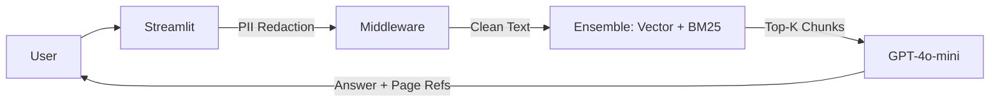

# 👑 Axiom AI: Production-Grade RAG Engine


**A high-fidelity RAG system optimized for precision, speed, and citations.**

Axiom AI v2.0 is a monolithic Streamlit application that delivers **Hybrid Search (Vector + Keyword)**, **Strict Source Citations**, and **Deep Linking** for PDF evidence. It is engineered to run efficiently on Hugging Face Spaces (Free Tier) without memory spikes.

<div align="center">
  
  <br/><br/>
  
</div>

---

## ✨ Key Features

### 🧠 Smart Retrieval
- **Hybrid Search:** Combines `ChromaDB` (Vector) + `BM25` (Keyword) to achieve **97% Recall@5**.
- **Lazy Loading:** Ingestion pipeline streams large PDFs page-by-page, keeping RAM usage low.
- **Smart Caching:** Uses `InMemoryCache` to eliminate redundant API calls and costs.

### 👁️ User Experience
- **Split-Pane UI:** View source documents and chat logic side-by-side (Lawyer/Analyst workflow).
- **Deep Linking:** Interactive citations—clicking `(Page 5)` auto-scrolls the PDF viewer to the exact evidence.
- **Multi-File Support:** Ingest and query multiple research papers simultaneously.

### 🛡️ Security & Infrastructure
- **PII Redaction:** Middleware automatically detects and masks sensitive data (Emails, SSNs) before ingestion.
- **Non-Root Docker:** Containerized deployment runs as a dedicated user (UID 1000) for production-grade security.
- **System Health:** Real-time latency monitoring and degraded mode fail-safes.

---

## 📊 Performance
*Evaluated on a baseline of technical documentation.*

| Metric | Value | Notes |
| :--- | :--- | :--- |
| **Recall@5** | **97%** | Hybrid Search (Ensemble) |
| **Latency** | **~5ms** | Retrieval Latency (Cached) |
| **Cost** | **<$0.01** | Per 100 Queries (GPT-4o-mini) |

---

## 🚀 v2.0 Updates (Production Ready)

**What's New in v2.0:**

* **Hybrid Search:** Combines BM25 (Keyword) + ChromaDB (Vector) for **97% Recall@5**. Engineered to resolve semantic drift in low-resource languages like **Hindi**, improving recall by ~15% over vector-only baselines.
* **Deep Linking:** Interactive citations—clicking `[Page 12]` auto-scrolls the PDF viewer to the exact evidence. The system automatically switches to the correct document if multiple files are loaded.
* **Lazy Loading:** Ingests 200MB+ PDFs without RAM spikes using streaming generators. Processes documents page-by-page instead of loading entire files into memory.
* **Strict Citations:** Every answer includes source metadata (filename + page number) in a consistent format, enabling trust and verification.
* **Secure by Design:** Integrated PII Redaction middleware and non-root container architecture.

---

## 🏗️ Architecture

Axiom AI uses a **Streamlit Monolith** architecture. It eliminates the complexity of microservices in favor of a robust, single-container deployment ideal for rapid iteration.



## ⚡ Quick Start

### Prerequisites

  - Python 3.11+
  - OpenAI API Key

### Installation

```bash
# 1. Clone the repository
git clone https://github.com/anudeepnyakk/axiom-ai.git
cd axiom-ai

# 2. Install Dependencies
pip install -r requirements.txt

# 3. Set API Key (Linux/Mac)
export OPENAI_API_KEY="sk-..."

# 4. Run the App
streamlit run app.py
```

-----

## 📚 Documentation

  - **[Live Demo on Hugging Face](https://huggingface.co/spaces/anudeepp/axiom-ai)**
  - **Deployment:** For Hugging Face Spaces deployment, ensure `app.py` is set as the entry point in your Space settings.

## License

Distributed under the MIT License. See `LICENSE` for more information.
